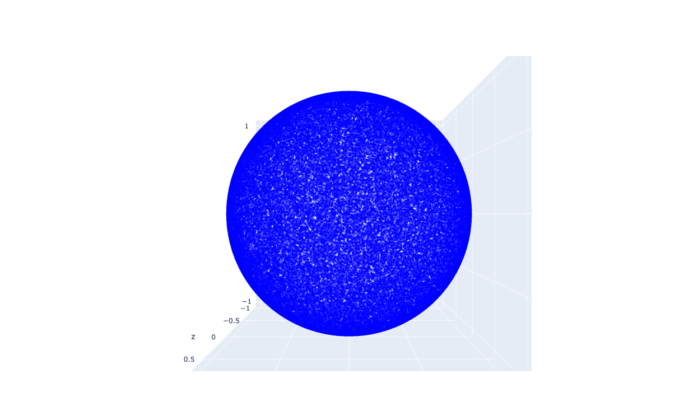
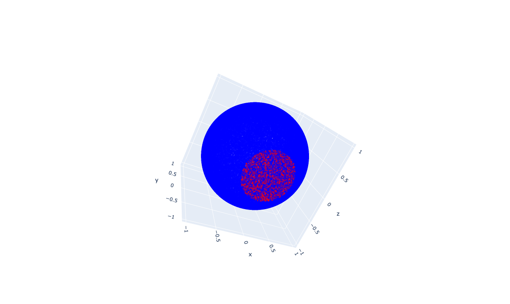
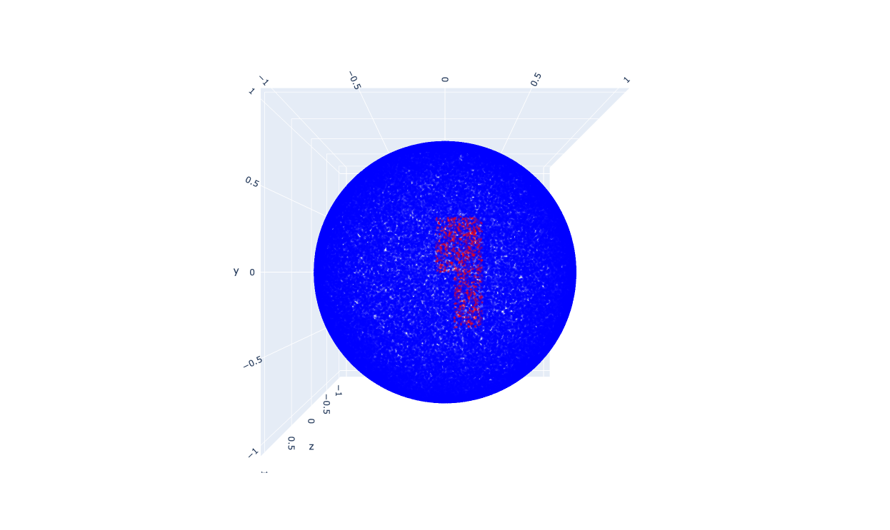

# MATH 407 - Probability Theory - Final Project

## Problem One

For this problem I utilized the numpy library to achieve a sufficiently random distribution of dots on my sphere and the plotly library in order to plot my points in 3d and allow for manipulation of the sphere.



For the estimation of the size of Antarctica I eyeballed it on the sphere after it was plotted and ended up with a satisfyingly close-to-truth estimation of its size.



For the estimation of the size of Africa I split it into two regions, the narrower Southern region and the wider Northern region, and looked at the approximate latitudes and longitudes. This also came up with a pretty good estimation.



My computer is also pretty powerful so I was able to play around with different amounts of dots being distributed and see how that affects the estimation.

```
Calculating for 1000 points:
Estimated area of Antarctica with 1000 points: 23,974,700.00 square kilometers (roughly 23.97 million km²)
Estimated area of Africa with 1000 points: 12,752,500.00 square kilometers (roughly 12.75 million km²)

Calculating for 10000 points:
Estimated area of Antarctica with 10000 points: 27,851,460.00 square kilometers (roughly 27.85 million km²)
Estimated area of Africa with 10000 points: 11,732,300.00 square kilometers (roughly 11.73 million km²)

Calculating for 100000 points:
Estimated area of Antarctica with 100000 points: 30,218,324.00 square kilometers (roughly 30.22 million km²)
Estimated area of Africa with 100000 points: 12,563,763.00 square kilometers (roughly 12.56 million km²)

Calculating for 1000000 points:
Estimated area of Antarctica with 1000000 points: 29,465,416.40 square kilometers (roughly 29.47 million km²)
Estimated area of Africa with 1000000 points: 12,354,622.00 square kilometers (roughly 12.35 million km²)
```

## Problem Two

This was a far more challenging problem for me. I started out with some tests of randomness I found online and built out a system capable of running multiple tests and prescribing different weights based on the lengths of the binary strings entered, as some of these tests are better suited for longer strings. I also added a test for the longest run of 1s and 0s in a row, as this is a good indicator of randomness. I then ran my tests on a few different strings of varying lengths and weights and pretty mixed results.

Afterwards I found [a stack overflow post](https://stackoverflow.com/questions/3097949/how-can-i-determine-the-statistical-randomness-of-a-binary-string) that had a test I was able to adapt which seems to have done a good job of determining the randomness of such short strings. I feel like this project would be cool to test on a larger scale.