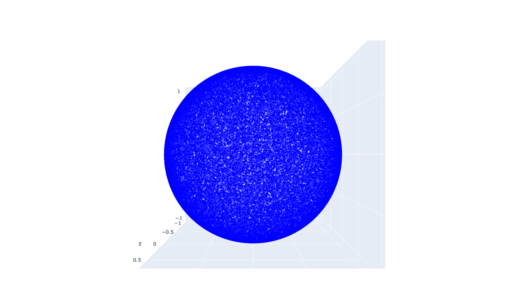

# MATH 407 - Probability Theory - Final Project

## Problem One

For this problem I utilized the numpy library to achieve a sufficiently random distribution of dots on my sphere and the plotly library in order to plot my points in 3d and allow for manipulation of the sphere.

// image of sphere

For the estimation of the size of Antarctica I eyeballed it on the sphere after it was plotted and ended up with a satisfyingly close-to-truth estimation of its size.

For the estimation of the size of Africa I split it into two regions, the narrower Southern region and the wider Northern region, and looked at the approximate latitudes and longitudes. This also came up with a pretty good estimation.

My computer is also pretty powerful so I was able to play around with different amounts of dots being distributed and see how that affects the estimation.

## Problem Two

This was a far more challenging problem for me. I started out with some